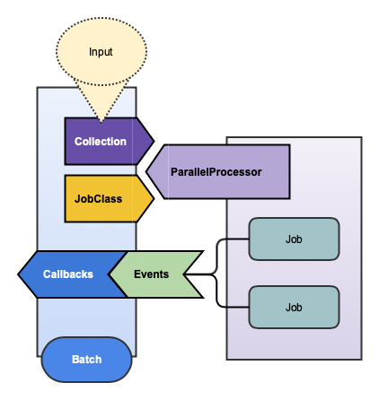
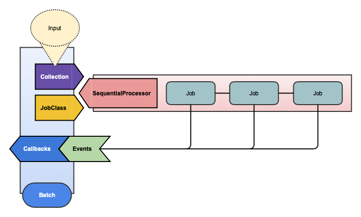

# BatchProcessor

Define your collection, job, and callbacks all in one clear and concise object

[](https://badge.fury.io/rb/batch_processor)
[](https://semaphoreci.com/freshly/batch_processor)
[](https://codeclimate.com/github/Freshly/batch_processor/maintainability)
[](https://codeclimate.com/github/Freshly/batch_processor/test_coverage)

* [Installation](#installation)
* [Getting Started](#getting-started)
* [What is BatchProcessor?](#what-is-batchprocessor)
* [How It Works](#how-it-works)
   * [Batches](#batches)
      * [Collection](#collection)
         * [Input](#input)
         * [Validations](#validations)
      * [ActiveJob](#activejob)
      * [Aborting](#aborting)
         * [Clearing](#clearing)
      * [Details](#details)
      * [Status](#status)
      * [Callbacks](#callbacks)
   * [Processors](#processors)
      * [Parallel Processor](#parallel-processor)
      * [Sequential Processor](#sequential-processor)
         * [Processor Options](#processor-options)
   * [Jobs](#jobs)
      * [Handling Errors](#handling-errors)
* [Testing](#testing)
   * [Testing Setup](#testing-setup)
   * [Testing Batches](#testing-batches)
   * [Testing Jobs](#testing-jobs)
   * [Integration Testing](#integration-testing)
* [Custom Processors](#custom-processors)
   * [Testing Processors](#testing-processors)
* [Contributing](#contributing)
   * [Development](#development)
* [License](#license)

## Installation

Add this line to your application's Gemfile:

```ruby
gem 'batch_processor'
```

And then execute:

    $ bundle

Or install it yourself as:

    $ gem install batch_processor

## Getting Started

BatchProcessor comes with some nice rails generators. You are encouraged to use them!

```bash
$ rails g batch_processor foo
  invoke  rspec
  create    spec/batches/foo_batch_spec.rb
  create  app/batches/foo_batch.rb
```

## What is BatchProcessor?

BatchProcessor is a framework for the sequential or parallel processing of jobs in Ruby on Rails.

BatchProcessor helps monitor, control, and orchestrate the work done by `ActiveJob`.

💁‍ This requires [Redis](https://github.com/redis/redis-rb) and a properly configured `ActiveJob` queue adapter (like [Sidekiq](https://github.com/mperham/sidekiq)).

## How It Works

TODO: Batch Lifecycle / Workflow Diagram

There are three important concepts to distinguish here: [Batches](#Batches), [Processors](#Processors), and [Jobs](#Jobs).

### Batches

A **Batch** defines, controls, and monitors the processing of a collection of items with an `ActiveJob`.

All Batches should be named with the `Batch` suffix (ex: `FooBatch`).

```ruby
class PodSprintCalculationBatch < ApplicationBatch
  set_callback(:batch_started, :before) { raise CalculationsNotRunning unless Calculator.busy? }

  on_batch_finished { Calculator.done! }

  class Collection < BatchCollection
    argument :sprint, allow_nil: false
    option :recalculate, default: false

    def items
      recalculate ? items_for_recalculation : items_for_calculation
    end

    def items_for_calculation
      items_for_recalculation.without_performance_metrics
    end

    def items_for_recalculation
      sprint.pod_sprints.with_performance_plans
    end
  end
end
```

A batch is a synthesis of four concepts: a [Collection](#Collection), an [ActiveJob](#ActiveJob), granular [Details](#Details), a summary [Status](#Status), and some [Callbacks](#Callbacks).

#### Collection

A `Collection` takes input to validate and build a (possibly ordered) list of items to process with the Batch's job.

Batches accept a unique identifier and input representing the arguments and options which define it's collection.

```ruby
batch_id = SecureRandom.hex
PodSprintCalculationBatch.process(batch_id: batch_id, sprint: Sprint.last)
```

##### Input

A collection accepts input represented by arguments and options which initialize it.

Arguments describe input required to define the initial state.

If any arguments are missing, an ArgumentError is raised.


```ruby
class ExampleJob < BatchProcessor::BatchJob
  def perform(arg)
    "OK #{arg}"
  end
end

class ExampleBatch < ApplicationBatch
  class Collection < BatchCollection
    argument :foo
    argument :bar
    
    def items
      [ foo, bar ]
    end
  end
end

ExampleBatch.process # => ArgumentError (Missing arguments: foo, bar)
ExampleBatch.process(foo: "foo") # => ArgumentError (Missing argument: bar)
ExampleBatch.process(foo: "foo", bar: "bar") # => #<ExampleBatch batch_id="XPf--GzdbRLyww">
```

By default, nil is a valid argument:

```ruby
ExampleBatch.process(foo: nil, bar: nil) # => #<ExampleBatch batch_id="f-GzXP-dbn3yxw">
```

If you want to require a non-nil value for your argument, set the allow_nil option (true by default):

```ruby
class ExampleBatch < ApplicationBatch
  class Collection < BatchCollection
    argument :foo
    argument :bar, allow_nil: false
    
    def items
      [ foo, bar ]
    end
  end
end

ExampleBatch.process(foo: nil, bar: nil) # => ArgumentError (Missing argument: bar)
```

Options describe input which may be provided to define or override the initial state.

Options can optionally define a default value.

If no default is specified, the value will be nil.

If the default value is static, it can be specified in the class definition.

If the default value is dynamic, you may provide a block to compute the default value.

⚠️‍ Heads Up: The default value blocks DO NOT provide access to the state or its other variables!

```ruby
class ExampleBatch < ApplicationBatch
  class Collection < BatchCollection
    option :attribution_source
    option :favorite_foods, default: %w[pizza ice_cream gluten]
    option(:favorite_color) { SecureRandom.hex(3) }
    
    def items
      [ attribution_source, favorite_foods, favorite_color ]
    end
  end
end

batch = ExampleBatch.process(favorite_foods: %w[avocado hummus nutritional_yeast])
collection = batch.collection

collection.attribution_source # => nil
collection.favorite_color # => "1a1f1e"
collection.favorite_foods # => ["avocado", "hummus" ,"nutritional_yeast"]
```

##### Validations

Collections are `ActiveModels` which means they have access to [ActiveModel::Validations](https://api.rubyonrails.org/classes/ActiveModel/Validations.html).

It is considered a best practice to write validations in your collections.

Batches which have an invalid collection will NOT start and therefore will not process any Jobs, so it is inherently the safest and clearest way to proactively communicate about missed expectations.

💁‍ Pro Tip: There is a `process!` method on Batches that will raise any errors (which are normally silenced). Invalid states are one such example!

```ruby
class ExampleBatch < ApplicationBatch
  class Collection < BatchCollection
    argument :first_name
  
    validates :first_name, length: { minimum: 2 }
    
    def items
      [ first_name ]
    end
  end
end

ExampleBatch.process!(first_name: "a") # => raises BatchProcessor::CollectionInvalidError

batch = ExampleBatch.process(first_name: "a")
batch.started? # => false
batch.collection_valid? # => false
batch.collection.errors.messages # => {:first_name=>["is too short (minimum is 2 characters)"]}
```

#### Aborting

TODO

##### Clearing

TODO

#### ActiveJob

When `.process` is called on a Batch, `.execute` is called on the `Processor` specified in the Batch's definition.

Unless otherwise specified a **Batch** assumes its Job class shares a common name.

Ex: `FooBarBazBatch` assumes there is a defined `FooBarBazJob`.

If you want to customize this behavior, define the job class explicitly:

```ruby
class ExampleBatch < ApplicationBatch
  process_with_job SomeOtherJob
end
```

#### Details

The **Details** of a batch are the times of critical lifecycle events and the summary counts of processed jobs.

```ruby
batch = ExampleBatch.process
details = batch.details

details.started_at # => 2019-07-25 12:13:44 UTC
details.size # => 1
details.pending_jobs_count # => 1
details.to_h # => {"class_name"=>"ExampleBatch", "started_at"=>"2019-07-25 08:13:44 -0400", "size"=>"1", "pending_jobs_count"=>"1"}
```

The details object is built with [RedisHash](https://github.com/Freshly/spicerack/tree/master/redis_hash) which works just like a plain old ruby Hash which makes calls to fetch data automatically.

⚠️ **Warning**: This hash is **NOT** cached so each method call makes a `Redis` call! `#FeatureNotABug`

```ruby
batch = ExampleBatch.process
details = batch.details

details.pending_jobs_count # => 3

# rake resque:work in another window...

details.pending_jobs_count # => 2
details.pending_jobs_count # => 1
```

##### Methods

| Name                    | Type       | Description                                |
| ----------------------- | ---------- | ------------------------------------------ |
| `batch_id`              | `String`   | The unique ID of the batch's instance.     |
| `class_name`            | `String`   | The name of the batch's class.             |
| `started_at`            | `DateTime` | When processing began on the batch.        |
| `enqueued_at`           | `DateTime` | `[Parallel]` When all jobs were enqueued.  |
| `aborted_at`            | `DateTime` | When `#abort!` was called on the batch.    |
| `cleared_at`            | `DateTime` | When `#clear!` was called on the batch.    |
| `finished_at`           | `DateTime` | When processing finished on the batch.     |
| `size`                  | `Number`   | Count of items in the batch's collection.  |
| `enqueued_jobs_count`   | `Number`   | `[Parallel]` Count of the jobs enqueued.   |
| `pending_jobs_count`    | `Number`   | Count of jobs waiting to be performed.     |
| `running_jobs_count`    | `Number`   | Count of jobs currently being performed.   |
| `successful_jobs_count` | `Number`   | Count of jobs performed successfully.      |
| `failed_jobs_count`     | `Number`   | Count of jobs which raised errors.         |
| `canceled_jobs_count`   | `Number`   | Count of jobs NOT performed from `abort`.  |
| `cleared_jobs_count`    | `Number`   | Count of missing jobs flushed by `clear`.  |
| `total_retries_count`   | `Number`   | Total count of retry attempts by all jobs. |
| `unfinished_jobs_count` | `Number`   | Current count of jobs pending and running. |
| `finished_jobs_count`   | `Number`   | Current count of jobs already performed.   |
| `total_jobs_count`      | `Number`   | Count of jobs (which should equal `size`). |

#### Status

The **Status** of a batch is manifested by a collection of predicates which track certain lifecycle events.

TODO: Table of Statuses

#### Callbacks

Batches have a status which is driven by the jobs it is processing. Callbacks are fired in response to status changes.

TODO: Table Of Callbacks

### Processors

A **Processor** is a service object which determines how to perform a Batch's jobs to properly process its collection.

Unless otherwise specified a **Batch** uses the `default` **Parallel** Processor.

```ruby
class DefaultBatch < ApplicationBatch; end
DefaultBatch.processor_class # => BatchProcessor::Processors::Parallel

class ExampleBatch < ApplicationBatch
  with_sequential_processor
end
ExampleBatch.processor_class # => BatchProcessor::Processors::Sequential

class OtherBatch < ApplicationBatch
  with_parallel_processor
end
OtherBatch.processor_class # => BatchProcessor::Processors::Parallel
```

The default processors can be redefined and new [custom processors](#custom-processors) can be added as well.

Create a `config/initializers/batch_processor.rb` to define these:

```ruby
# Make sequential processor the default
ApplicationBatch::PROCESSOR_CLASS_BY_STRATEGY[:default] = BatchProcessor::Processors::Sequential
```

Certain processors have configurable options; this configuration is specified in the Batch's definition.

```ruby
class ExampleBatch < ApplicationBatch
  with_sequential_processor
  processor_option :continue_after_exception, true
end
```

BatchProcessor comes with two standard processors: **Parallel** and **Sequential**.

#### Parallel Processor



The Parallel Processor enqueues jobs to be performed later.

#### Sequential Processor



The Sequential Processor uses `.perform_now` to procedurally process each job within the current thread.

##### Processor Options

| Name                       | Description                                 |
| -------------------------- | ------------------------------------------- |
| `continue_after_exception` | If true, batch continues after job error.   |
| `sorted`*                  | If true, `#find_each` will **not** be used. |

💁‍ Note: `find_each` is used when possible, which ignores `order`; the flag only forces `#each`.

### Jobs

BatchProcessor depends on ActiveJob for handling the processing of individual items in a collection.

Only a **BatchJob** can be used to perform work, but it can be run outside of a batch as well.
 
Therefore, the recommendation is to make `ApplicationJob` inherit from `BatchJob`.

The `rails g batch_processor:install` does this for you:

```ruby
class ApplicationJob < BatchProcessor::BatchJob; end
```

A BatchJob calls into the Batch to report on it's lifecycle from start to finish, including on success and failure.

#### Handling Errors

TODO

## Testing

TODO

### Testing Setup

TODO

### Testing Batches

TODO

### Testing Jobs

TODO

### Integration Testing

TODO

## Custom Processors

TODO

### Testing Processors

TODO

## Contributing

Bug reports and pull requests are welcome on GitHub at https://github.com/Freshly/batch_processor.

### Development

After checking out the repo, run `bin/setup` to install dependencies. Then, run `rake spec` to run the tests. You can also run `bin/console` for an interactive prompt that will allow you to experiment.

To install this gem onto your local machine, run `bundle exec rake install`. To release a new version, update the version number in `version.rb`, and then run `bundle exec rake release`, which will create a git tag for the version, push git commits and tags, and push the `.gem` file to [rubygems.org](https://rubygems.org).

## License

The gem is available as open source under the terms of the [MIT License](https://opensource.org/licenses/MIT).
