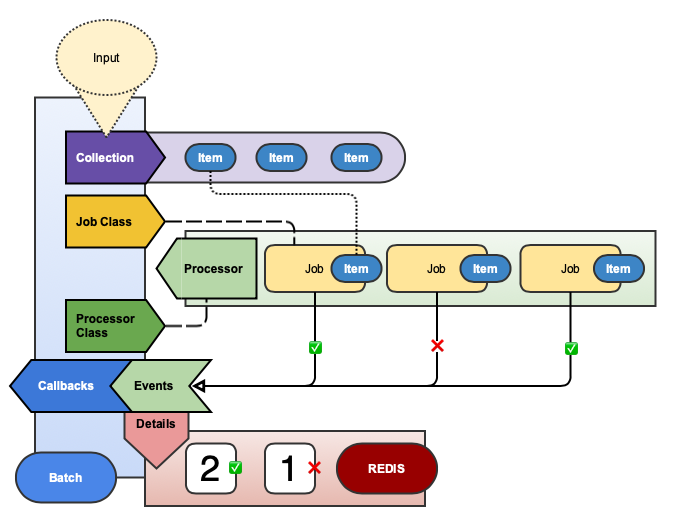

# BatchProcessor

Define your collection, job, and callbacks all in one clear and concise object

[](https://badge.fury.io/rb/batch_processor)
[](https://semaphoreci.com/freshly/batch_processor)
[](https://codeclimate.com/github/Freshly/batch_processor/maintainability)
[](https://codeclimate.com/github/Freshly/batch_processor/test_coverage)

* [Installation](#installation)
* [Getting Started](#getting-started)
* [What is BatchProcessor?](#what-is-batchprocessor)
* [How It Works](#how-it-works)
   * [Batches](#batches)
      * [Collection](#collection)
         * [Input](#input)
         * [Validations](#validations)
      * [ActiveJob](#activejob)
         * [Retries](#retries)
      * [Details](#details)
         * [Detail Methods](#detail-methods)
      * [Status](#status)
         * [Status Methods](#status-methods)
      * [Callbacks](#callbacks)
         * [Callback Methods](#callback-methods)
   * [Processors](#processors)
      * [Parallel Processor](#parallel-processor)
      * [Sequential Processor](#sequential-processor)
         * [Processor Options](#processor-options)
   * [Jobs](#jobs)
      * [Handling Errors](#handling-errors)
* [Troubleshooting](#troubleshooting)
  * [Best Practice](#best-practice)
  * [Aborting](#aborting)
     * [Clearing](#clearing)
  * [Monitor Job](#monitor-job)
  * [Monitor Cron](#monitor-cron)
* [Testing](#testing)
   * [Testing Setup](#testing-setup)
   * [Testing Batches](#testing-batches)
   * [Testing Jobs](#testing-jobs)
   * [Integration Testing](#integration-testing)
* [Custom Processors](#custom-processors)
   * [Testing Processors](#testing-processors)
* [Contributing](#contributing)
   * [Development](#development)
* [License](#license)

## Installation

Add this line to your application's Gemfile:

```ruby
gem 'batch_processor'
```

And then execute:

    $ bundle

Or install it yourself as:

    $ gem install batch_processor

## Getting Started

BatchProcessor comes with some nice rails generators. You are encouraged to use them!

```bash
$ rails g batch_processor foo
  invoke  rspec
  create    spec/batches/foo_batch_spec.rb
  create  app/batches/foo_batch.rb
```

## What is BatchProcessor?

BatchProcessor is a framework for the sequential or parallel processing of jobs in Ruby on Rails.

BatchProcessor helps monitor, control, and orchestrate the work done by `ActiveJob`.

💁‍ This requires [Redis](https://github.com/redis/redis-rb) and a properly configured `ActiveJob` queue adapter (like [Sidekiq](https://github.com/mperham/sidekiq)).

## How It Works



There are three key concepts to distinguish here: [Batches](#Batches), [Processors](#Processors), and [Jobs](#Jobs).

### Batches

A **Batch** defines, controls, and monitors the processing of a collection of items with an `ActiveJob`.

All Batches should be named with the `Batch` suffix (ex: `FooBatch`).

```ruby
class PodSprintCalculationBatch < ApplicationBatch
  set_callback(:batch_started, :before) { raise CalculationsNotRunning unless Calculator.busy? }

  on_batch_finished { Calculator.done! }

  class Collection < BatchCollection
    argument :sprint, allow_nil: false
    option :recalculate, default: false

    def items
      recalculate ? items_for_recalculation : items_for_calculation
    end

    def items_for_calculation
      items_for_recalculation.without_performance_metrics
    end

    def items_for_recalculation
      sprint.pod_sprints.with_performance_plans
    end
  end
end
```

A batch is a synthesis of four concepts: a [Collection](#Collection), an [ActiveJob](#ActiveJob), granular [Details](#Details), a summary [Status](#Status), and some [Callbacks](#Callbacks).

#### Collection

A `Collection` takes input to validate and build a (possibly ordered) list of items to process with the Batch's job.

Batches accept a unique identifier and input representing the arguments and options which define it's collection.

```ruby
batch_id = SecureRandom.hex
PodSprintCalculationBatch.process(batch_id: batch_id, sprint: Sprint.last)
```

You can supply any unique value you want for a `batch_id`:

```ruby
attempt_number = 1
current_date = Date.today
batch_id = "daily-charge-batch:#{current_date}:#{attempt_number}"

ChargeBatch.process(batch_id: batch_id, date: current_date)
```

Which you can then pass to `ApplicationBatch.find` to load:

```ruby
batch = ApplicationBatch.find("daily-charge-batch:#{Date.today}:1")
batch.class.name # => ChargeBatch
batch.batch_id # => "daily-charge-batch:2019-07-25:1"
```

If you do not specify a `batch_id` one will be randomly generated.

```ruby
batch = ChargeBatch.process(date: Date.today)
batch.batch_id # => XP-f-G23bNFwww
```

##### Input

A collection accepts input represented by arguments and options which initialize it.

Arguments describe input required to define the initial state.

If any arguments are missing, an ArgumentError is raised.

```ruby
class ExampleJob < BatchProcessor::BatchJob
  def perform(arg)
    "OK #{arg}"
  end
end

class ExampleBatch < ApplicationBatch
  class Collection < BatchCollection
    argument :foo
    argument :bar
    
    def items
      [ foo, bar ]
    end
  end
end

ExampleBatch.process # => ArgumentError (Missing arguments: foo, bar)
ExampleBatch.process(foo: "foo") # => ArgumentError (Missing argument: bar)
ExampleBatch.process(foo: "foo", bar: "bar") # => #<ExampleBatch batch_id="XPf--GzdbRLyww">
```

By default, nil is a valid argument:

```ruby
ExampleBatch.process(foo: nil, bar: nil) # => #<ExampleBatch batch_id="f-GzXP-dbn3yxw">
```

If you want to require a non-nil value for your argument, set the allow_nil option (true by default):

```ruby
class ExampleBatch < ApplicationBatch
  class Collection < BatchCollection
    argument :foo
    argument :bar, allow_nil: false
    
    def items
      [ foo, bar ]
    end
  end
end

ExampleBatch.process(foo: nil, bar: nil) # => ArgumentError (Missing argument: bar)
```

Options describe input which may be provided to define or override the initial state.

Options can optionally define a default value.

If no default is specified, the value will be nil.

If the default value is static, it can be specified in the class definition.

If the default value is dynamic, you may provide a block to compute the default value.

⚠️‍ Heads Up: The default value blocks DO NOT provide access to the state or its other variables!

```ruby
class ExampleBatch < ApplicationBatch
  class Collection < BatchCollection
    option :attribution_source
    option :favorite_foods, default: %w[pizza ice_cream gluten]
    option(:favorite_color) { SecureRandom.hex(3) }
    
    def items
      [ attribution_source, favorite_foods, favorite_color ]
    end
  end
end

batch = ExampleBatch.process(favorite_foods: %w[avocado hummus nutritional_yeast])
collection = batch.collection

collection.attribution_source # => nil
collection.favorite_color # => "1a1f1e"
collection.favorite_foods # => ["avocado", "hummus" ,"nutritional_yeast"]
```

##### Validations

Collections are `ActiveModels` which means they have access to [ActiveModel::Validations](https://api.rubyonrails.org/classes/ActiveModel/Validations.html).

It is considered a best practice to write validations in your collections.

Batches which have an invalid collection will NOT start and therefore will not process any Jobs, so it is inherently the safest and clearest way to proactively communicate about missed expectations.

💁‍ Pro Tip: There is a `process!` method on Batches that will raise any errors (which are normally silenced). Invalid states are one such example!

```ruby
class ExampleBatch < ApplicationBatch
  class Collection < BatchCollection
    argument :first_name
  
    validates :first_name, length: { minimum: 2 }
    
    def items
      [ first_name ]
    end
  end
end

ExampleBatch.process!(first_name: "a") # => raises BatchProcessor::CollectionInvalidError

batch = ExampleBatch.process(first_name: "a")
batch.started? # => false
batch.collection_valid? # => false
batch.collection.errors.messages # => {:first_name=>["is too short (minimum is 2 characters)"]}
```

#### ActiveJob

When `.process` is called on a Batch, `.execute` is called on the `Processor` specified in the Batch's definition.

Unless otherwise specified a **Batch** assumes its Job class shares a common name.

Ex: `FooBarBazBatch` assumes there is a defined `FooBarBazJob`.

If you want to customize this behavior, define the job class explicitly:

```ruby
class ExampleBatch < ApplicationBatch
  process_with_job SomeOtherJob
end
```

##### Retries

BatchProcessor is designed to work with ActiveJob's built in retries.

Any job with a valid retry strategy will be allowed to exhaust all of it's attempts before it will be considered failed.

When a job raises with retries remaining, the batch essentially "ignores" it ever ran, which allows it to be retried.

To keep track of how often these handled failures are happening, the batch keeps a running tally of total retries.
 
```ruby
batch = AppplicationBatch.find(batch_id)
batch.details.total_retries_count # => 15
```

In this example the `15` count could mean any number of things:

1. A single job raised, and was retried, 15 times.
2. 3 jobs raised and were retried their maximum of 5 times before failing.
3. 5 jobs raised and were retried their maximum of 3 times before failing.
4. 15 different jobs all raised once and were retried, all of which were successful.
5. 13 different jobs all raised once, and one failed twice more on top of that, before finished successfully.

Because of the wide variety of cases this covers, the batch cannot and doesn't try to make decisions off this.

Instead, this information is tracked to provide developers with some introspection as to the behavior of the batch.

Ideally, the final state of the batch combined with the retry information and server logs should allow you to determine.

💡 **Note**: Batch failure is only triggered after **all** retries are exhausted for the job.

#### Details

The **Details** of a batch are the times of critical lifecycle events and the summary counts of processed jobs.

```ruby
batch = ExampleBatch.process
details = batch.details

details.started_at # => 2019-07-25 12:13:44 UTC
details.size # => 1
details.pending_jobs_count # => 1
details.to_h # => {"class_name"=>"ExampleBatch", "started_at"=>"2019-07-25 08:13:44 -0400", "size"=>"1", "pending_jobs_count"=>"1"}
```

The details object is built with [RedisHash](https://github.com/Freshly/spicerack/tree/master/redis_hash) which works just like a plain old ruby Hash which makes calls to fetch data automatically.

⚠️ **Warning**: This hash is **NOT** cached so each method call makes a `Redis` call! `#FeatureNotABug`

```ruby
batch = ExampleBatch.process
details = batch.details

details.pending_jobs_count # => 3

# rake resque:work in another window...

details.pending_jobs_count # => 2
details.pending_jobs_count # => 1
```

##### Detail Methods

| Name                  | Type     | Description                                |
| --------------------- | -------- | ------------------------------------------ |
| batch_id              | String   | The unique ID of the batch's instance.     |
| class_name            | String   | The name of the batch's class.             |
| started_at            | DateTime | When processing began on the batch.        |
| enqueued_at           | DateTime | `[Parallel]` When all jobs were enqueued.  |
| aborted_at            | DateTime | When `#abort!` was called on the batch.    |
| cleared_at            | DateTime | When `#clear!` was called on the batch.    |
| finished_at           | DateTime | When processing finished on the batch.     |
| size                  | Number   | Count of items in the batch's collection.  |
| enqueued_jobs_count   | Number   | `[Parallel]` Count of the jobs enqueued.   |
| pending_jobs_count    | Number   | Count of jobs waiting to be performed.     |
| running_jobs_count    | Number   | Count of jobs currently being performed.   |
| successful_jobs_count | Number   | Count of jobs performed successfully.      |
| failed_jobs_count     | Number   | Count of jobs which raised errors.         |
| canceled_jobs_count   | Number   | Count of jobs NOT performed from `abort`.  |
| cleared_jobs_count    | Number   | Count of missing jobs flushed by `clear`.  |
| total_retries_count   | Number   | Total count of retry attempts by all jobs. |
| unfinished_jobs_count | Number   | Current count of jobs pending and running. |
| finished_jobs_count   | Number   | Current count of jobs already performed.   |
| total_jobs_count      | Number   | Count of jobs (which should equal `size`). |

#### Status

The **Status** of a batch is manifested by a collection of predicates which track certain lifecycle events.

```ruby
batch = ExampleBatch.process
batch.started? # => true
batch.enqueued? # => false
batch.aborted? # => false
batch.finished? # => true

batch.enqueued_jobs? # => false
batch.finished_jobs? # => true
```

##### Status Methods

| Name              | Description                                     |
| ----------------- | ----------------------------------------------- |
| started?          | True if `started_at` is defined for the batch.  |
| enqueued?         | True if `enqueued_at` is defined for the batch. |
| aborted?          | True if `aborted_at` is defined for the batch.  |
| cleared?          | True if `cleared_at` is defined for the batch.  |
| finished?         | True if `finished_at` is defined for the batch. |
| enqueued_jobs?    | True if `enqueued_jobs_count > 0`.              |
| pending_jobs?     | True if `pending_jobs_count > 0`.               |
| running_jobs?     | True if `running_jobs_count > 0`.               |
| failed_jobs?      | True if `failed_jobs_count > 0`.                |
| canceled_jobs?    | True if `canceled_jobs_count > 0`.              |
| unfinished_jobs?  | True if `unfinished_jobs_count > 0`.            |
| finished_jobs?    | True if `finished_jobs_count > 0`.              |
| collection_valid? | True if all the Collection's validations pass.  |
| processing?       | True if started, unfinished, and not aborted.   |

#### Callbacks

Batches have a status which is driven by the jobs it is processing. Callbacks are fired in response to status changes.

```ruby
class ExampleBatch < ApplicationBatch
  class Collection < BatchCollection
    def items
      [ SecureRandom.hex ]
    end
  end
  
  on_batch_started { SlackClient.send_message("Batch started!") }
  on_batch_finished { SlackClient.send_message("Batch finished!") }
  
  on_batch_aborted :handle_batch_aborted, unless: -> { Business.during_business_hours? }
  on_batch_cleared :handle_batch_cleared, if: :important?
  
  def important?
    batch_id.include?("vip")
  end
  
  def handle_batch_aborted
    EmailClient.send_email("management@business.engineering", "Unexpected batch abort!", batch_id)
  end
  
  def handle_batch_cleared
    EmailClient.send_email("developers@business.engineering", "Crazy stuff happened!", details.to_h)
  end
end
```

##### Callback Methods

| Name              | Triggered when...                                   |
| ----------------- | --------------------------------------------------- |
| on_batch_started  | The batch is started.                               |
| on_batch_enqueued | `[Parallel]` All batch jobs are enqueued.           |
| on_batch_aborted  | The batch is aborted.                               |
| on_batch_cleared  | The batch is cleared.                               |
| on_batch_finished | The batch is finished.                              |
| on_job_enqueued   | A batch job is enqueued.                            |
| on_job_running    | A batch job begins performing.                      |
| on_job_success    | A batch job is successfully performed.              |
| on_job_failure    | A batch job raises an error being performed.        |
| on_job_retried    | A batch job is retried rather than failing.         |
| on_job_canceled   | A batch job skips perform after a batch is aborted. |

### Processors

A **Processor** is a service object which determines how to perform a Batch's jobs to properly process its collection.

Unless otherwise specified a **Batch** uses the `default` **Parallel** Processor.

```ruby
class DefaultBatch < ApplicationBatch; end
DefaultBatch.processor_class # => BatchProcessor::Processors::Parallel

class ExampleBatch < ApplicationBatch
  with_sequential_processor
end
ExampleBatch.processor_class # => BatchProcessor::Processors::Sequential

class OtherBatch < ApplicationBatch
  with_parallel_processor
end
OtherBatch.processor_class # => BatchProcessor::Processors::Parallel
```

The default processors can be redefined and new [custom processors](#custom-processors) can be added as well.

Create a `config/initializers/batch_processor.rb` to define these:

```ruby
# Make sequential processor the default
ApplicationBatch::PROCESSOR_CLASS_BY_STRATEGY[:default] = BatchProcessor::Processors::Sequential
```

Certain processors have configurable options; this configuration is specified in the Batch's definition.

```ruby
class ExampleBatch < ApplicationBatch
  with_sequential_processor
  processor_option :continue_after_exception, true
end
```

BatchProcessor comes with two standard processors: **Parallel** and **Sequential**.

#### Parallel Processor


The Parallel Processor enqueues jobs to be performed later.

#### Sequential Processor


The Sequential Processor uses `.perform_now` to procedurally process each job within the current thread.

⚠️ **WARNING**: Using a sequential processors disables job retries in a batch **even if they are defined and valid**!

##### Processor Options

| Name                       | Description                                 |
| -------------------------- | ------------------------------------------- |
| `continue_after_exception` | If true, batch continues after job error.   |
| `sorted`*                  | If true, `#find_each` will **not** be used. |

💁 **HEADS UP**: `find_each` is used when possible, which ignores `order`; the flag only forces `#each`.

### Jobs

BatchProcessor depends on ActiveJob for handling the processing of individual items in a collection.

Only a **BatchJob** can be used to perform work, but it can be run outside of a batch as well.
 
Therefore, the recommendation is to make `ApplicationJob` inherit from `BatchJob`.

The `rails g batch_processor:install` does this for you:

```ruby
class ApplicationJob < BatchProcessor::BatchJob; end
```

A BatchJob calls into the Batch to report on it's lifecycle from start to finish, including on success and failure.

#### Handling Errors

When an error occurs in a BatchJob it will be tracked as a failure within a batch.

This is true even if a `rescue_from` handler is defined for the batch.

Intentionality is very difficult to ascertain in a topic as nuanced as error handling, so batches make some assumptions.

1. If you define a `rescue_from`, you want to treat that exception as a batch failure BUT NOT a job failure.
1. If you define a `rescue` in the `perform` block, you want to treat the exception as NEITHER a batch NOR job failure.
1. If you define no rescue of any kind, you want to treat that exception as BOTH a batch AND a job failure.

Because `BatchProcessor` cannot speculate on it therefore doesn't attempt to control your application's error handling.

Instead, it only brings this incredibly dire warning:

⚠️ **WARNING**: You should never **EVER** "manually retry" a batch job! This can mess up the counter!

Defining a valid retry strategy within the job is the **ONLY** way to handle retries of a batch job! 

If you attempt to manually re-enqueue a batch job from your processors failed queue, you **WILL** have a bad time.

Instead, you should always follow the [Troubleshooting](#troubleshooting) guide to handle exceptional failures.

👍 **NOTE**: It is considered a "best practice" to define error handling for all your jobs, batchable or otherwise!

## Troubleshooting

Sometimes, `"weird stuff"` (this is a technical term) happens on the internet.

One example is a vanishing job:

- A job is picked off the queue and usually takes 18 seconds process.
- 5 seconds into performing, the worker received a `SIGTERM`.
- The worker, being Resque, decides to dirty exit instead of graceful shutdown.
- The job never completes, never is retried, never enters the queue again, and never reports status.
- The `running_jobs_count` of your batch and will contain a count that will never go down.
- Because one of the jobs has not reported in, the batch will never complete.

⚠️ **Warning**: This kind of "weird stuff" can always happen, and at scale **WILL** always happen! Be prepared!

### Best Practice

Troubleshooting this issue will be very similar to troubleshooting any batch issues, but no two issues are fully alike.

What follows is therefore the generic "best practice" for handling any class of batch issue.

1. Abort the Batch. This stops any new batches from processing and allows any enqueued jobs to flush from the workers.
2. Damage Report. Figure out what went wrong and what needs to be cleaned up. 
3. Cleanup Fallout. Perform all the cleanup as determined in step 2.
4. Wait. Allow time for the workers to chew through and cancel the pending jobs in your aborted batch.
5. Clear the Batch. Manually flush any lost jobs, forcing the batch to run it's completion events.

**Abort the Batch**

```ruby
batch = ApplicationBatch.find(batch_id)
batch.abort!
```

**Damage Report**

💡 **Note**: By the nature of async processing your jobs can (and likely will, given enough workers) fail at every line:

```ruby
class ExampleJob < ApplicationJob
  def perform(order)
    raise NotProcessing unless order.payment_processing?
    
    order.mark_charge_starting!
    
    charge_service = ChargeService.new(order)
    charge_result = charge_service.charge!
    
    if charge_result.success?
      order.mark_charge_success!
    else
      order.mark_payment_failed!
    end
  end
end
```

In this example, if you had say, 30 workers processing your batch, you could expect to see the following issues:

- Orders which were taken off the queue, marked as running, and then never passed the guard clause.
- Orders which were marked that the charge was starting, but the service was never instantiated.
- 😱 Orders which were submitted and a customer's money was taken, but your application has no record of that!
- Orders submitted and a customer did not have funds available, but the application has no record of that EITHER!!
- We get the response, but are not capable of reporting success about the charge in the database.
- We actually record success in the database but the job cannot report itself as having completed to the batch!

💁‍ **The Rule of Law**: For every `N` lines of code in your job, you create `N+2` **at least** unique problems. 😬
 
### Aborting

Batches can be **Aborted**.


When aborted, processing *will continue* on enqueued jobs but **those jobs will not be performed**.

Abort only prevents new jobs from being performed, as this is less disruptive (and much easier) than queue flushing.

When a job is skipped because of an aborted batch, it reports itself as **canceled**.

```ruby
batch = ApplicationBatch.find(some_batch_id)
details = batch.details

details.performed_jobs_count # => 7
details.performed_jobs_count # => 8
details.canceled_jobs_count # => 0

batch.abort!

details.performed_jobs_count # => 8
details.canceled_jobs_count # => 1
details.canceled_jobs_count # => 2
```

💡 **Note**: Running jobs will complete normally if `#abort!` was called after perform began on them.

#### Clearing

Because clearing is a manual process only to be used in exceptional circumstances, it **requires** the batch be aborted.

In these cases, after a developer intervenes to assess the impact of the failure, the batch can be manually cleared.

```ruby
batch = ApplicationBatch.find(some_batch_id)
details = batch.details

details.size # => 10
details.pending_jobs_count # => 2
details.running_jobs_count # => 2
details.finished_jobs_count # => 6
details.cleared_jobs_count # => 0

details.clear!

details.running_jobs_count # => 0
details.pending_jobs_count # => 0
details.cleared_jobs_count # => 4
```

💡 **Note**: Calling `#clear!` on a batch will trigger the batch completion events and finish the batch.

There is no use case to `#clear!` an in-flight batch and doing so is incredibly disruptive and corrupt the counts.

### Monitor Job

Because of the nature of `"weird stuff"` that can happen in processing, it's highly encouraged you add monitoring.

The most common kind of monitoring that supports operations like this well are "dead man switches".

[Dead Man's Snitch](https://deadmanssnitch.com) is an example of a monitoring service that can help!

You could also construct a batch monitor job that works for any / all batches and can be enqueued alongside:

```ruby
class BatchMonitorJob < ApplicationBatch
  queue_name :a_higher_priority_than_any_jobs
  
  def perform(batch_id)
    batch = ApplicationBatch.find(batch_id)
    batch.abort! unless batch.finished? 
  end
end
```

With a job like this, you can add a monitor to any batch:

```ruby
batch_id = SecureRandom.hex
SomeImportantBatch.process(batch_id: batch_id)
BatchMonitorJob.set(wait: 20.minutes).perform_later(batch_id)
```

There are *several* important notes here. 

**Delayed Jobs**

You must have configured ActiveJob with a queue processor that supports delayed jobs, and any extra hoops therein.

💁 **Example**: On Resque, a second worker and suite of gems is required to support `.set(wait: 20.minutes)`!

Please make sure to consult your given ActiveJob queue processor's own documentation for supporting delayed jobs.

**Delay**

There is no such thing as "normal" for what to expect for processing time. You can expectation set using the following:

```text
good_timeout = ((number_of_jobs * average_time_per_job) / average_number_of_workers_available) + rand(5).minutes
```

For some batches, you may expect 10 minutes to be more than sufficient to process the whole workload.

For other batches, you may expect 2 hours to be a very conservative and aggressive estimate for completion.

Sometimes, the 10 minute batch could take over 2 hours if enqueued at the same time if other jobs are taking resources.

Because of the great variability here, you need to assess the differences of your own environment and adapt accordingly.

**Queue Priority**

Delayed jobs get enqueued after their delay at the REAR of the queue.

As such, your monitor **must** have a higher priority than any of jobs it's meant to monitor!

Otherwise it will be enqueued and processed after all the jobs finish, which defeats the purpose of this!

Because queueing theory is hard and there isn't really a great standard and several approaches, you're on your own here.

Sorry, and godspeed!

**Notifications**

This automation is only a "best practice" for keeping things more or less clean. 

Anytime an abort happens, developers likely need to look into why, as it should be considered an exceptional event.

As such, you are encouraged to setup notifications and alerting to communicate these events to your staff.

There are lots of solutions for how to setup this kind of monitoring, like using an internal mailer:

```ruby
class ApplicationBatch < BatchProcessor::BatchBase
  on_batch_aborted { EngineeringMailer.batch_timeout(batch: self) }
end
```

### Monitor Cron

Another alternative which inherits different constraints is setting up a cron task to monitory our batches.

Again, depending on the specifics of your environment and needs, there are several different solutions here as well.

Let's assume you already have invested in a cron solution like the [clockwork gem](https://rubygems.org/gems/clockwork).

If you know for instances that your charge batch was certainly supposed to have started by 8PM, write that:

```ruby
every(1.day, 'charge_start.job', at: '20:00') do
  batch_id = "charge-batch-for-#{Date.today}"
  begin
    batch = ApplicationBatch.find(batch_id)
    EngineeringMailer.charge_batch_not_started(batch_id) unless batch.started?
  rescue StandardError => exception
    EngineeringMailer.charge_batch_not_found(exception)
  end
end
```

Likewise, if by 10PM it needs to be finished or you want it aborted, write that:

```ruby
every(1.day, 'charge_start.job', at: '22:00') do
  batch_id = "charge-batch-for-#{Date.today}"
  begin
    batch = ApplicationBatch.find(batch_id)
    # Assuming you have some kind of generic `on_batch_abort` that handles notifications
    batch.abort! unless batch.completed?
  rescue StandardError => exception
    EngineeringMailer.charge_batch_not_found(exception)
  end
end
```

## Testing

If you plan on writing `RSpec` tests `BatchProcessor` comes packaged with some custom matchers.

### Testing Setup

Add the following to your spec/rails_helper.rb file:

```ruby
require "batch_prcessor/spec_helper"
```

BatchProcessor works best with [shoulda-matchers](https://github.com/thoughtbot/shoulda-matchers) and [rspice](https://github.com/Freshly/spicerack/tree/master/rspice).

Add them to the development and test group of your Gemfile:

```ruby
group :development, :test do 
  gem "shoulda-matchers", git: "https://github.com/thoughtbot/shoulda-matchers.git", branch: "rails-5"
  gem "rspice"
end
```

Then run `bundle install` and add the following into `spec/rails_helper.rb`:

```ruby
require "rspec/rails"
require "rspice"
require "batch_processor/spec_helper"

# Configuration for the shoulda-matchers gem
Shoulda::Matchers.configure do |config|
  config.integrate do |with|
    with.test_framework :rspec
    with.library :rails
  end
end
```

This will allow you to use the following custom matchers:

* [set_processor_option](lib/batch_processor/rspec/custom_matchers/set_processor_option.rb) tests usages of batches specifying processor options.
* [use_default_job_class](lib/batch_processor/rspec/custom_matchers/use_default_job_class.rb) tests usages of batches which do not explicitly specify a job.
* [use_default_processor](lib/batch_processor/rspec/custom_matchers/use_default_processor.rb) tests usages of batches which do not explicitly specify a processor.
* [use_job_class](lib/batch_processor/rspec/custom_matchers/use_job_class.rb) tests usages of batches which explicitly specify a job.
* [use_parallel_processor](lib/batch_processor/rspec/custom_matchers/use_parallel_processor.rb) tests usages of `.with_parallel_processor`.
* [use_sequential_processor](lib/batch_processor/rspec/custom_matchers/use_sequential_processor.rb) tests usages of `.with_sequential_processor`.

There are also some internal matchers added:

* [use_batch_processor_strategy](lib/batch_processor/rspec/custom_matchers/use_batch_processor_strategy.rb) is used to DRY out the similarities between the other batch processor matchers.

### Testing Batches

The best way to test a Batch is with an integration test.

The easiest way to test a Batch is with a unit test.

Batches are generated with the following RSPec template:

```ruby
# frozen_string_literal: true

require "rails_helper"

RSpec.describe FooBatch, type: :batch do
  subject { described_class }

  it { is_expected.to inherit_from BatchProcessor::BatchBase }

  # it { is_expected.to use_sequential_processor }
  # it { is_expected.to use_parallel_processor }

  # it { is_expected.to be_allow_empty }

  # it { is_expected.to use_default_job_class }
  # it { is_expected.to use_job_class OtherJob }

  # it { is_expected.to set_processor_option :continue_after_exception, true }
  # it { is_expected.to set_processor_option :sorted, true }
  # it { is_expected.not_to be_allow_empty }

  describe FooBatch::Collection, type: :batch_collection do
    subject { described_class.new }

    it { is_expected.to inherit_from BatchProcessor::BatchBase::BatchCollection }
    # it { is_expected.to define_argument :arg, allow_nil: false }
    # it { is_expected.to define_option :opt, default: 3 }
  end
end
```

#### Testing Collections

If your Collections are complicated enough that you want to put them into a separate file, they are **too** complicated.

Collections are expected to be incredibly straightforward objects with minimal validations and logic.

Highly maintainable collections should essentially be input sanity checks around something like an `ActiveRecord` scope:

```ruby
class Collection < BatchCollection
  argument :charge_date
  
  validate :charge_date, date: { is_today_or_future: true }
  
  def items
    Orders.to_charge_on(charge_date).payment_pending
  end
end
```

This will allow you to keep this class as a slim, which is the intent!

### Testing Jobs

BatchProcessor, though heavily reliant on jobs, does not include anything special or specific to test them.

Any job descending from `BatchProcessor::BatchableJob` (which has `ActiveJob::Base` as its parent) is batchable.

You can **and should** test your jobs, but there is nothing "special about them".

Ideally, if you're starting with a collection of well-built jobs, they should work nearly effortlessly here.

Admittedly "well-built" is subjective, but taken here to mean "clearly defined error handling and one responsibility".

Generally speaking the same suggestions for testing collections apply to `ActiveJob`.

🤓 **HUMBLE OBSERVATION**: The best jobs are slim wrappers around clearly defined services.

```ruby
class ExampleJob < ApplicationJob
  def perform(id)
    the_thing = Thing.find(id)
    raise Thing::Locked if the_thing.locked?
    
    the_thing.lock!
    info :locked_thing, the_thing: the_thing
    
    the_stuff = Stuff.for(the_thing)
    info :got_stuff, the_stuff: the_stuff
    
    the_thing.make_do(the_stuff)
    info :made_the_thing_do_the_stuff
  end
end

# Executed with...
ExampleJob.perform_later(the_thing.id)
```

You should always move all that stuff into a service object:

```ruby
class ExampleJob < ApplicationJob
  def perform(the_thing)
    DoTheStuffService.for(the_thing)
  end
end

# Let globalID take care of this! Don't reinvent wheels!
ExampleJob.perform(the_thing)
```

If this feels right to you, check out [flow](https://github.com/Freshly/flow). You'll like what you see, I guarantee it.

### Integration Testing

Effective integration testing for batches requires you to configure `ActiveJob` for testing.

There are lots of solutions to this puzzle, so you're expected to pick your own poison in that regard.

Once you have everything configured to effectively unit test jobs, you can confirm the behavior of your batch.

A comprehensive suite of integration tests for a batch will cover three contexts:

1) When the batch finishes successfully.
2) When the batch finishes with some errors.
3) When you manually intervene with the batch.

These are basically the only circumstances that you will actually encounter in the real world, so you should test them.

Writing general purpose handlers for batch aborts and clears will save you a lot of trouble and excess testing!

Pretty much every manual intervention in a batch will elicit a "stuff is on fire" response from the team anyway.

## Custom Processors

You are able to define your own custom processors and use them with the batch processor.

The following example is incredibly contrived for the purposes of demonstration:

Let's say you wanted a `NoBobProcessor` which enqueued jobs for anyone unless they had `Bob` in their name. 

First, create an `app/batch_processors` directory. (really it can be in any folder, but why not be explicit?)

Then create your new `NoBobProcessor` class which is a descendant of `BatchProcessor::ProcessorBase`.

Generally speaking, when defining a processor you only need to define one method: `#process_collection_item`

This method is called with each and every item from a Batch's `Collection` and the processor decides what to do with it.

In our example, we will add a string-matching guard clause to exclude the `Bob`s of the world from processing.

When writing processors, it's always best to assume a generic case. 

For now, let's assume that's either being a string representing a name, or an object with a `#name` property to check.

```ruby
class NoBobProcessor < BatchProcessor::ProcessorBase
  # Required for parallel processors to keep accurate and expected reporting
  set_callback(:collection_processed, :after) { batch.enqueued }

  def process_collection_item(item)
    return if for_a_bob?(item)
  
    job = batch.job_class.new(item)
    job.batch_id = batch.batch_id
    job.enqueue
  end
  
  private
  
  def for_a_bob?(item)
    name = item.name if item.respond_to?(:name)
    name ||= item if item.is_a?(String)
    raise ArgumentError, "Unknown item: #{item}" if name.nil?
  
    name.include?("Bob")
  end
end
```

Then, it needs to be register as a processing strategy so batches can utilize it.

To define it, create or edit a `config/initializers/batch_processor.rb` file and add the following line:

```ruby
ApplicationBatch::PROCESSOR_CLASS_BY_STRATEGY[:no_bobs] = NoBobProcessor
```

This will enable you to specify this processor within your batch:

```ruby
class ChargeNoBobsBatch < ApplicationBatch
  use_no_bobs_processor
  
  # ...
end
```

Reference your new processor by the name you used to enter it with the `PROCESSOR_CLASS_BY_STRATEGY` hash.

You can refer to the existing [processors](lib/batch_processor/processors) for reference.

### Testing Processors

Testing custom processors is best suited by unit tests and confirmed by integration tests. 

There's a lot that can go wrong when batching lots of jobs is involved, and it really helps to have unit tests on this.

I can't offer more guidance on writing good unit tests for processors other than suggesting [riffing on these](spec/batch_processor/processors).

## Contributing

Bug reports and pull requests are welcome on GitHub at https://github.com/Freshly/batch_processor.

### Development

After checking out the repo, run `bin/setup` to install dependencies. Then, run `rake spec` to run the tests. You can also run `bin/console` for an interactive prompt that will allow you to experiment.

To install this gem onto your local machine, run `bundle exec rake install`. To release a new version, update the version number in `version.rb`, and then run `bundle exec rake release`, which will create a git tag for the version, push git commits and tags, and push the `.gem` file to [rubygems.org](https://rubygems.org).

## License

The gem is available as open source under the terms of the [MIT License](https://opensource.org/licenses/MIT).
